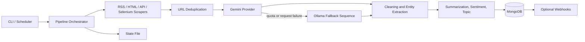

# News Scraper Open

[](https://github.com/christianfitaram/news-scraper-open/actions/workflows/ci.yml)

[](LICENSE)


News Scraper Open is an open-source version of a production news ingestion and enrichment pipeline, focused on reliable scraping, LLM-assisted enrichment, provider fallback, deduplication, and MongoDB persistence.

It is designed as a practical application codebase rather than a framework. The current architecture centers on a single Python package, `news_crawler/`, with clear separation between scraping, processing, providers, repositories, and orchestration.

## What It Does

- Scrapes articles from RSS, HTML, API, and Selenium-backed sources
- Deduplicates already-seen URLs before persistence
- Cleans article text and extracts entities with Gemini or Ollama
- Summarizes text with Hugging Face BART or Gemini-backed NLP
- Classifies sentiment and topic with local Hugging Face models or Gemini-backed NLP
- Persists enriched results and pipeline metadata to MongoDB
- Supports resumable state and downstream webhooks

## Reliability Features

- **Deduplication:** processed URLs are tracked in MongoDB through `link_pool`; dry-runs also dedupe in memory.
- **State persistence:** scraper progress and batch counters are saved through `StateManager`, enabling resumable runs.
- **Provider fallback:** Gemini is preferred when enabled, then requests can fall back to an ordered Ollama model sequence.
- **Quota handling:** Gemini quota errors activate a process-level cooldown so later LLM calls skip Gemini until the retry window expires.
- **Webhook retries:** webhook delivery retries transient `429` and `5xx` responses with exponential backoff.
- **Selenium fallback notes:** Selenium scrapers are optional because browser automation is more fragile than RSS/API extraction; the pipeline keeps independent scrapers isolated so one source failure does not stop the run.

## Architecture



## Current LLM Support

The project currently supports two text-cleaning and entity-extraction backends:

- Google GenAI / Gemini
- Ollama

Selection behavior:

- If `ENABLE_GENAI=1` and a valid Google API key is present, Gemini is preferred.
- If a Gemini request fails or quota is exhausted and `ENABLE_OLLAMA=1`, requests fall back to the configured Ollama model sequence.
- The default fallback order is `gpt-oss:120b-cloud`, `gemma4:31b-cloud`, then `gpt-oss:20b-cloud`.
- If both are disabled, the pipeline still runs, but LLM-based cleaning and entity extraction are skipped.

The fallback sequence can be changed with `OLLAMA_FALLBACK_MODELS`.

## Tech Stack

- Python 3.10+
- MongoDB with PyMongo
- Trafilatura, BeautifulSoup4, Feedparser, Selenium
- Hugging Face Transformers and PyTorch
- Google GenAI SDK
- Typer and Rich

## Project Layout

```text
news-scraper-open/
├── news_crawler/
│   ├── core/           # Config, orchestrator, state
│   ├── db/             # Mongo client
│   ├── processors/     # Summarization and classification
│   ├── providers/      # Gemini, Ollama, webhooks
│   ├── repositories/   # Mongo repositories
│   ├── scrapers/       # Source integrations
│   └── utils/          # Logging and text helpers
├── scripts/            # Bootstrap and maintenance commands
├── tests/              # Pytest suite
└── main.py             # CLI entry point
```

## Installation

Recommended development setup:

```bash
poetry install
poetry shell
```

Alternative setup:

```bash
python -m venv .venv
source .venv/bin/activate
pip install -r requirements.txt
```

## Configuration

Create a local environment file:

```bash
cp .env.example .env
```

Important variables:

- `MONGO_URI`
- `MONGODB_DB`
- `HF_HOME`
- `ENABLE_GENAI`
- `ENABLE_OLLAMA`
- `GEMINI_API_KEY` or `GOOGLE_API_KEY`
- `NLP_BACKEND` (`local` or `gemini`)
- `SUMMARIZER_BACKEND` (`local` or `gemini`, optional override)
- `SENTIMENT_BACKEND` (`local` or `gemini`, optional override)
- `TOPIC_BACKEND` (`local` or `gemini`, optional override)
- `OLLAMA_HOST`
- `OLLAMA_PORT`
- `OLLAMA_MODEL`
- `OLLAMA_FALLBACK_MODELS`
- `ENABLE_SELENIUM_SCRAPERS`
- `ENABLE_NEWSAPI_SCRAPER`
- `NEWSAPI_KEY`
- `ENABLE_WEBHOOKS`
- `WEBHOOK_URL`
- `WEBHOOK_URL_THREAD_EVENTS`

### Minimal Local Modes

Dry-run without MongoDB writes:

```bash
news-scraper run --dry-run --limit 10
```

Gemini-enabled run:

```bash
ENABLE_GENAI=1 ENABLE_OLLAMA=1 news-scraper run --limit 10
```

Ollama-only run:

```bash
ENABLE_GENAI=0 ENABLE_OLLAMA=1 news-scraper run --limit 10
```

## Usage

Installed CLI:

```bash
news-scraper run
news-scraper run --dry-run
news-scraper run --limit 50
news-scraper run --resume
news-scraper run --reset-state
news-scraper run --verbose
news-scraper status
news-scraper reset
```

Direct entrypoint:

```bash
python main.py run
python main.py run --limit 50
python main.py status
```

Maintenance commands:

```bash
news-scraper-bootstrap
news-scraper-bootstrap-indexes
news-scraper-bootstrap-indexes --dedupe
news-scraper-dedupe-articles --limit 100
news-scraper-dedupe-articles --apply
```

## Example Output Document

Sanitized MongoDB article document:

```json
{
  "_id": "665f0b9d7b6f2a3c1e8d9012",
  "title": "Central bank signals slower rate cuts as inflation cools",
  "url": "https://example.com/business/rates-inflation",
  "source": "example-news",
  "scraped_at": "2026-04-20T06:30:00Z",
  "text": "Cleaned article body omitted for brevity.",
  "summary": "The central bank signaled a slower pace of rate cuts after new inflation data showed prices easing but still above target.",
  "topic": "business and finance",
  "sentiment": {
    "label": "NEUTRAL",
    "score": 0.72
  },
  "locations": ["United States", "Washington"],
  "organizations": ["Federal Reserve", "Labor Department"],
  "persons": ["Jerome Powell"],
  "llm_models": {
    "cleaning": [
      {"provider": "genai", "model": "gemini-2.0-flash"}
    ],
    "entity_extraction": [
      {"provider": "ollama", "model": "gpt-oss:120b-cloud"}
    ],
    "summary": [
      {"provider": "ollama", "model": "gemma4:31b-cloud"}
    ],
    "classification": [
      {"provider": "ollama", "model": "gpt-oss:20b-cloud"}
    ]
  },
  "sample": "4e04c3de-7437-4db2-8c20-a62433f37e19"
}
```

## MongoDB Collections

- `articles`: enriched article documents
- `link_pool`: deduplication and processing state
- `metadata`: batch-level statistics
- `pipeline_logs`: structured pipeline events

## Testing

Run the test suite:

```bash
pytest
```

Run with coverage:

```bash
pytest --cov=news_crawler --cov-report=term --cov-report=html
```

## Operational Notes

- Selenium-based scrapers are inherently more brittle than RSS-based scrapers.
- NewsAPI scraping is optional and only runs when `ENABLE_NEWSAPI_SCRAPER=1` and `NEWSAPI_KEY` is configured.
- Webhooks are optional and only run when enabled and configured.
- Hugging Face models are cached under `HF_HOME`.
- Model-based cleaning, entity extraction, summarization, and classification are best-effort features and should be monitored in production.

## Legal and Usage Notes

- You are responsible for complying with the terms of service, licenses, and access policies of the upstream sites and APIs you use with this project.
- This repository includes scrapers for public news sources, but source markup and access restrictions may change at any time.
- LLM outputs may be incomplete or inaccurate; keep raw source references when using this data downstream.

## Contributing

See [CONTRIBUTING.md](CONTRIBUTING.md).

## Security

See [SECURITY.md](SECURITY.md).

## License

This project is licensed under the MIT License. See [LICENSE](LICENSE).
